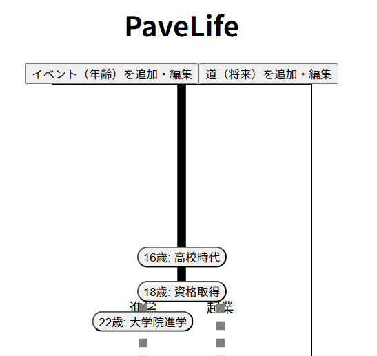

# PaveLife - 人生の道を描くTodoアプリ

PaveLife（ペイブライフ）は、人生を一本の「道」として可視化し、長期的な目標やタスクを管理するためのアプリケーションです。
過去から現在までは一本の道として、未来は選択肢によって分岐する道として表現され、ユーザーは自分の人生の軌跡（Pave）をデザインできます。

サイト利用は[こちら](https://create-alt.github.io/PaveLife/)から



## 🚀 特徴

* **人生の可視化**: 誕生から死（想定寿命）までを縦スクロールの「道」として描画します。
* **過去と未来の区別**:
    * **過去〜現在**: 確定した一本の実線で表示。
    * **未来**: 不確定さを表す点線で表示。
* **分岐する未来**: 将来の道（キャリアプランやライフスタイルなど）を複数作成し、並行して管理できます。
* **年齢ごとのイベント管理**: 「20歳：大学入学」「30歳：起業」など、年齢に基づいたイベントを道の上に配置できます。
* **道ごとの独立管理**: 分岐した道ごとにイベントを配置でき、他の道のイベントと表示が重ならないように自動調整されます。
* **Todo管理**: 各イベントの中に、詳細なTodoリスト（タスク）を作成・管理できます。
* **自動レイアウト**:
    * 道を追加すると、描画エリアが自動的に横に広がります。
    * イベントを追加すると、道が自動的に縦に伸びます。
* **データ永続化**: 入力したデータはブラウザの `localStorage` に保存されるため、リロードしても消えません。

## 🛠 技術スタック

このプロジェクトは以下のモダンなフロントエンド技術で構築されています。

* **Framework**: React (v18)
* **Build Tool**: Vite
* **Language**: TypeScript
* **Styling**: Tailwind CSS
* **Icons/UI**: SVG (Custom implementation)
* **State Management**: React Hooks (`useState`, custom `useLocalStorage`)

## 📂 ディレクトリ構成

```text
src
├── components
│   ├── AddEventForm.tsx    # イベント追加フォーム
│   ├── LifePath.tsx        # メインの「道」描画コンポーネント (SVG描画ロジック含む)
│   ├── PathEditPanel.tsx   # 将来の道（Path）の追加・編集・削除パネル
│   ├── TodoItem.tsx        # Todoリストの各アイテム
│   └── TodoPage.tsx        # イベント詳細（Todoリスト）ページ
├── hooks
│   └── useLocalStorage.ts  # ローカルストレージ保存用のカスタムフック
├── App.tsx                 # アプリケーションのエントリーポイント
├── initData.ts             # 初期データ定義
├── types.ts                # 型定義 (LifeData, AgeEvent, FuturePath, Todo)
├── main.tsx
└── index.css               # Tailwind CSSのエントリー
````

## 💻 セットアップと実行

このプロジェクトをローカル環境で実行するには、以下の手順に従ってください。

### 前提条件

  * Node.js (v16以上推奨)
  * npm または yarn

### インストール

```bash
# 依存関係のインストール
npm install
# または
yarn install
```

### 開発サーバーの起動

```bash
npm run dev
# または
yarn dev
```

コマンド実行後、ターミナルに表示されるURL（通常は `http://localhost:5173`）にブラウザでアクセスしてください。

## 📝 使い方

1.  **道の作成**:
      * 「道（将来）を追加・編集」ボタンをクリックして編集パネルを開きます。
      * 新しい道の名前を入力して追加したり、既存の道の名前変更・削除ができます。
2.  **イベントの追加**:
      * 「イベント（年齢）を追加・編集」ボタンをクリックしてフォームを開きます。
      * 年齢とタイトルを入力し、配置する「道」を選択して追加します。
3.  **Todoの管理**:
      * 道の上に表示されたイベントボタンをクリックすると、その時期に行うべきTodoリストの編集画面に遷移します。
      * タスクの追加、編集、削除、完了チェックが行えます。
4.  **編集・削除**:
      * 各編集モードにて、イベントや道の修正・削除が可能です。

## 🚧 今後のロードマップ

  * [ ] **UI/UXの改善**: 配色やアニメーションなど、より洗練されたデザインへの刷新
  * [ ] **道の統合機能**: 分岐した道を将来のどこかで合流させる機能
  * [ ] **データのエクスポート/インポート**: JSON形式でのバックアップ機能

## 📄 License

This project is licensed under the MIT License.