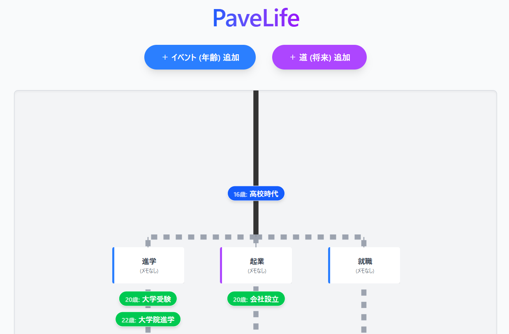
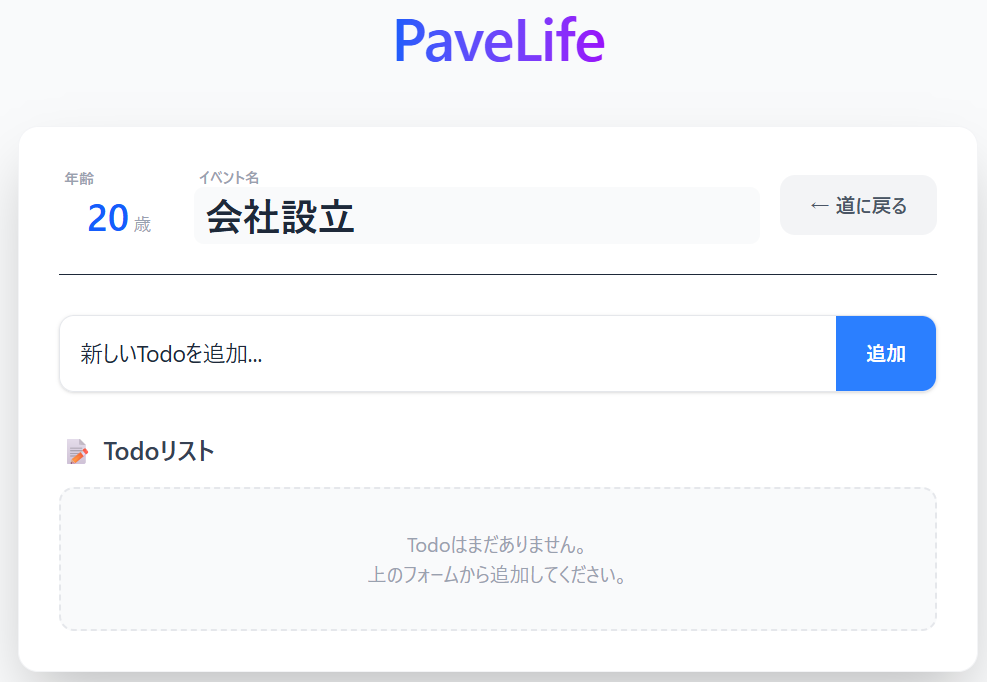

# PaveLife - 人生の道を描くTodoアプリ

**PaveLife（ペイブライフ）** は、人生を一本の「道」として可視化し、長期的な目標やタスクを管理するためのアプリケーションです。
「過去」は一本の確定した道として、「未来」は選択肢によって分岐する道として表現され、ユーザーは自分の人生の軌跡（Pave）を能動的にデザインできます。

サイト利用は[こちら](https://create-alt.github.io/PaveLife/)から



## 🌟 作品コンセプト

**「人生を俯瞰し、選択肢を可視化する」**

日々のタスクに追われるだけでなく、「自分の人生がどこに向かっているのか」を視覚的に捉えることを目的としています。
* **過去から現在**: 積み重ねてきた一本の道（実線）。
* **未来**: 無数の可能性が広がる分岐点（点線）。
* **Pave（舗装する）**: 自分の歩む道を、自分自身の手で切り開き、整えていくという意思を込めています。

## 🎮 操作方法

### 1. 初期設定（自分の人生を定義する）
画面右上の **⚙️（歯車アイコン）** をクリックして設定モーダルを開きます。
* **誕生日**: 起点となる日付を設定します。
* **現在の年齢**: 「過去」と「未来」の境界線を決定します。
* **想定寿命**: 人生のゴール（道の長さ）を設定します。


### 2. 将来の道を作る（分岐）
「**＋ 道 (将来) 追加**」ボタンから編集モードに入ります。
* 「起業ルート」「海外移住ルート」など、将来の選択肢となる道を作成します。
* 各道の入り口には「看板（Signboard）」が立ち、クリックすることで名前やメモを後から編集できます。

### 3. イベント（マイルストーン）を置く
「**＋ イベント (年齢) 追加**」ボタンからイベントを作成します。
* 年齢とイベント名（例：「25歳：留学」）を入力します。
* **配置する道**を選択することで、特定のルート上にイベントを配置できます。
* 現在年齢以下のイベントは自動的に中央の「過去の道」に配置されます。

### 4. Todoリストの管理
道の上に配置されたイベントボタン（例：「18歳：受験」）をクリックすると、詳細画面が開きます。
* その時期に達成すべき具体的なTodoタスクを追加・管理できます。
* イベント名の編集もここで行えます（※年齢は整合性を保つため編集不可となっています）。



## 💡 工夫点（こだわり）

### 1. 直感的な「道」の表現とUX
* **実線と点線の使い分け**: 過去は「変えられない実線」、未来は「不確定な点線」で描画し、時間軸を視覚的に表現しました。
* **看板（Signboard）UI**: 未来の分岐点には看板を設置。クリックして詳細を確認・編集できるようにし、「道を選ぶ」感覚を演出しています。
* **重ならないレイアウト**: 年齢が近いイベントが連続してもボタン同士が重ならないよう、Y座標を自動計算して最低限の間隔（ギャップ）を確保するアルゴリズムを実装しています。

### 2. ストレスのない操作性
* **スタイリッシュなフォーム**: 入力フォームやボタンには丸みと影（Shadow）を持たせ、モダンで親しみやすいデザインにしました。
* **動的なキャンバス**: 道を増やせば横に、寿命やイベントを増やせば縦に、描画エリアが自動で拡張されます。
* **データの永続化**: サーバー不要で、ブラウザの `localStorage` にデータを自動保存します。

### 3. データの整合性維持
* **道の削除時の挙動**: ある「道」を削除する際、その道に関連付いていたイベントやタスクも整合性を保つために一括で削除する安全策を講じています。
* **過去イベントの自動配置**: 誤って「未来の道」に「過去の年齢」を設定しても、ロジックが自動的に「メインの道（中央）」へ補正して配置します。

## 🛠 技術スタック

* **Frontend Framework**: React (v18)
* **Language**: TypeScript
* **Build Tool**: Vite
* **Styling**: Tailwind CSS
* **Graphics**: SVG (Scalable Vector Graphics) for dynamic path rendering

## 💻 セットアップ

```bash
# リポジトリのクローン
git clone <repository-url>
cd PaveLife

# 依存関係のインストール
npm install

# 開発サーバーの起動
npm run dev
```

## ⌚ 現在までの開発期間

2025.11.01 ~ 2025.11.19 (約20時間)

## 📄 License

This project is licensed under the MIT License.
